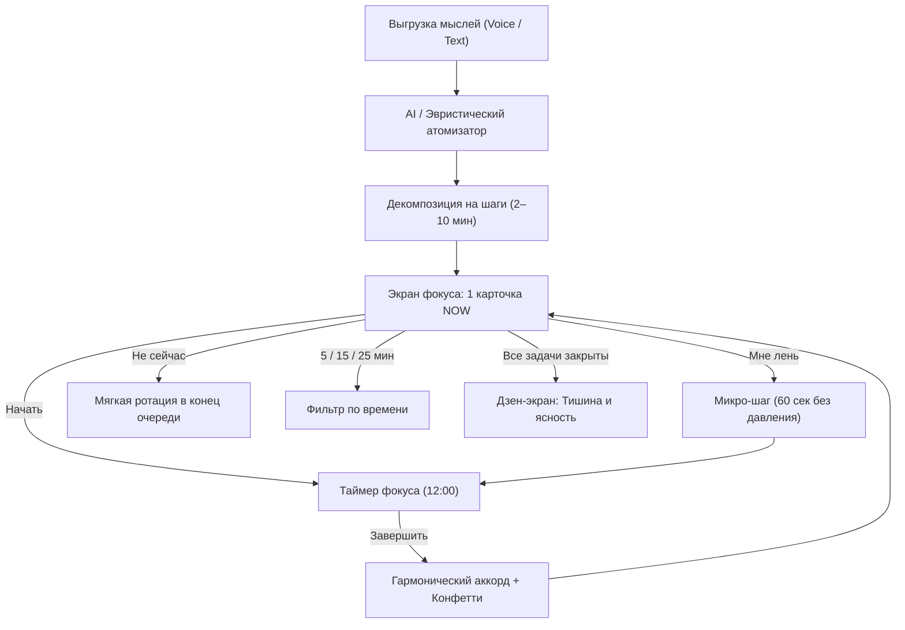

# NOW — Одно действие вместо списка дел

> *"You don't need a plan. You need the next step."*  
> *«Не думай, что делать. Просто сделай следующий шаг.»*

---

##  Философия продукта (в стиле Джони Айва / Apple)

Классические менеджеры задач вызывают **«паралич принятия решений»** и **чувство вины**:
- 🔴 *17 задач в списке*
- 🔴 *8 просрочено*
- 🔴 *43 задачи на этой неделе*
→ Итог: стресс, прокрастинация и закрытое приложение.

**NOW** решает фундаментальную психологическую проблему:
Человек открывает приложение и видит **ровно одну карточку**. Никакого бэклога, никаких списков, никаких красных бейджей с дедлайнами.

### 4 столпа простоты:
1. **Единственное действие на холсте**: В каждый момент времени существует только *«Здесь и сейчас»*.
2. **«Мне лень» (Снятие порога входа)**: Вместо давления приложение трансформирует задачу в 30–60-секундный микро-шаг («Подними одну вещь», «Просто открой файл»). Как только мозг преодолевает трение первого движения, включается естественная мотивация.
3. **«У меня есть 5 / 15 / 25 минут»**: Умный фильтр, который мгновенно подбирает подходящее дело под образовавшееся окно.
4. **Тактильный аудио-отклик (Web Audio)**: Приятный чистый гармонический аккорд при завершении (как в гаджетах Apple) и мягкий переход к следующему действию.

---

## 🛠 Полная схема работы (User Journey & Loop)



---

## 📱 Быстрый запуск

Приложение написано на чистом, легковесном стеке без внешних зависимостей. Его можно запустить прямо в браузере или сохранить на рабочий стол как PWA (на Mac / iPhone / iPad):

1. **Запустить локальный сервер** (рекомендуется):
   ```bash
   cd /Users/jupsik/Desktop/NOW-ToDo
   python3 -m http.server 3000
   ```
   и открыть `http://localhost:3000`.
2. **Быстрый просмотр** — двойной клик по `index.html`. Интерфейс работает, но через `file://` браузер не включает офлайн-режим (service worker), установку PWA и уведомления.

> Для установки на iPhone приложение должно открываться по **https** (любой статический хостинг: GitHub Pages, Netlify, Vercel). Уведомления на iOS работают только в установленном PWA («Поделиться» → «На экран Домой», iOS 16.4+).

### 🔄 Обновление версии
После изменения файлов увеличь `CACHE_NAME` в `sw.js` (например, `now-app-v3`) — старый кэш удалится автоматически.

### ⚠️ Ограничения
- Таймер считается по времени устройства и корректно «догоняет» после сворачивания, но iOS не выполняет JavaScript свёрнутого PWA — уведомление о конце таймера придёт только когда приложение активно. Для гарантированных фоновых уведомлений нужен Web Push с сервером.
- Разбор мыслей — встроенная эвристика по ключевым словам (офлайн), не нейросеть.

---

## 💎 Монетизация ($1/месяц)
- **Free**: До 5 активных шагов в очереди, базовый атомизатор, локальное хранение.
- **Pro ($1/мес)**: Безлимитные шаги, продвинутый AI-разбор контекста, облачная синхронизация между устройствами, персональная адаптация под ваш ритм дня.
